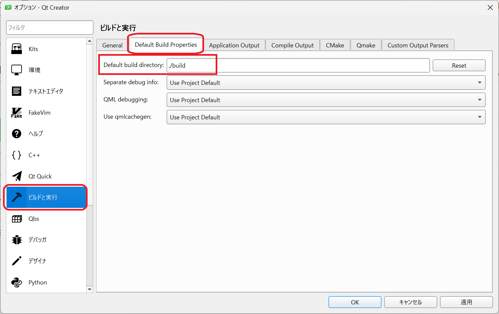
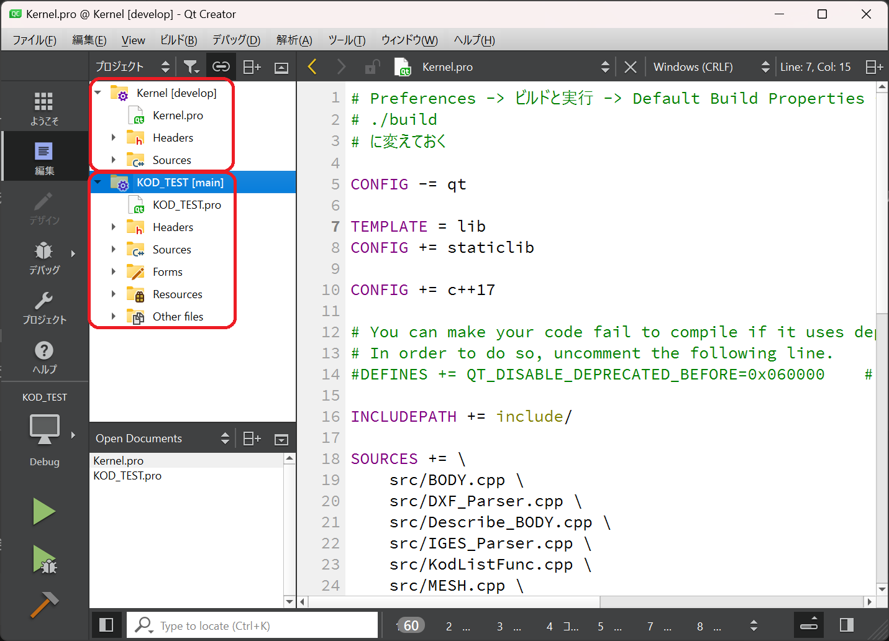
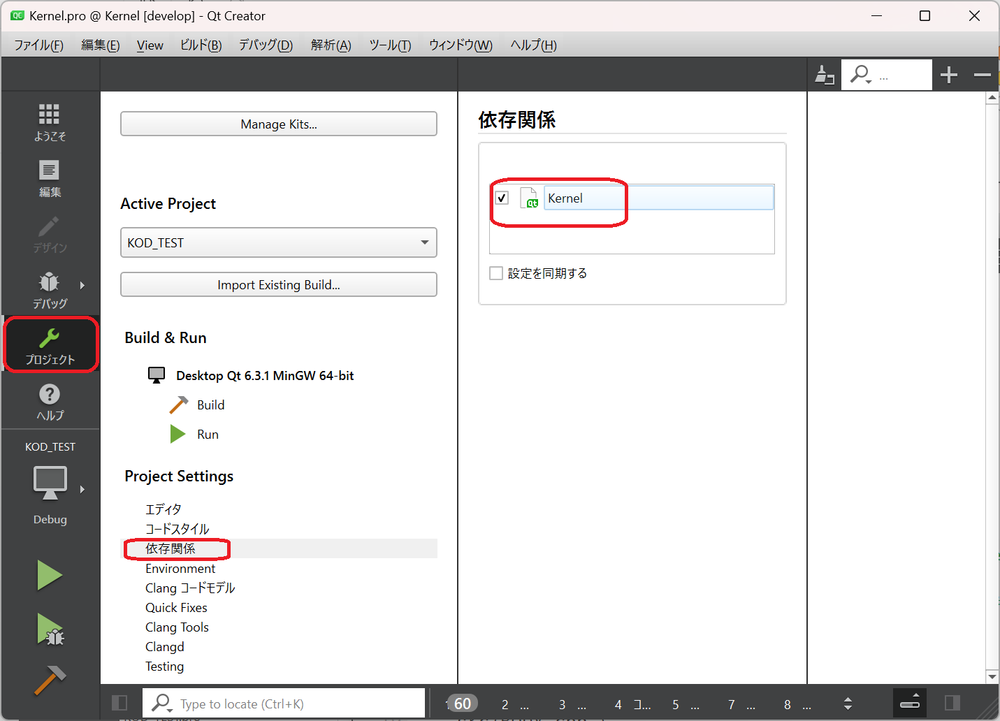

# Kodatuno Kernel

## Kodatuno について
Kodatuno は，金沢大学マンマシン研究室で開発されているオープンソースのCAMカーネルです．
本家は <http://www-mm.hm.t.kanazawa-u.ac.jp/research/kodatuno/>

## 本リポジトリについて
本家 Kodatuno から Kernel に相当する Src/GE を抜き出し，Qt のスタティックライブラリとして構築しなおしたものです．
各々の環境では，ここで生成される .lib または .a をリンクして Kodatuno の機能が使えるようになる予定です．

ファイル構成を含めてまだまだ試行中です．

## ライブラリのビルド方法

* Qtのセットアップは [本家インストールしてみた](http://www-mm.hm.t.kanazawa-u.ac.jp/research/kodatuno/inst/) から
 [セットアップマニュアル(R3.5/Windows10)](http://www-mm.hm.t.kanazawa-u.ac.jp/research/kodatuno/inst/20220617-01/SetUpGuide_R3.5_win10.pdf) を参考にしてください．

* Qtのデフォルトビルドディレクトリを以下のように変えておくことをオススメしています．

* QtからKernel.proのプロジェクトファイルを開きビルドすると，build配下にlibKernel.aが作られます．

## ライブラリの使用方法

* includeフォルダの設定と，上記のライブラリをリンクするようにすれば使えるようになります．
詳しくは <https://github.com/KodatunoOrg/KOD_TEST> を参照ください．

## カーネルの動作確認について（Kernel開発者のみ）
テスト用アプリのプロジェクトを同時に読み込んで依存関係を設定しておくと，
カーネルの変更を検知してアプリが再ビルドされます．

